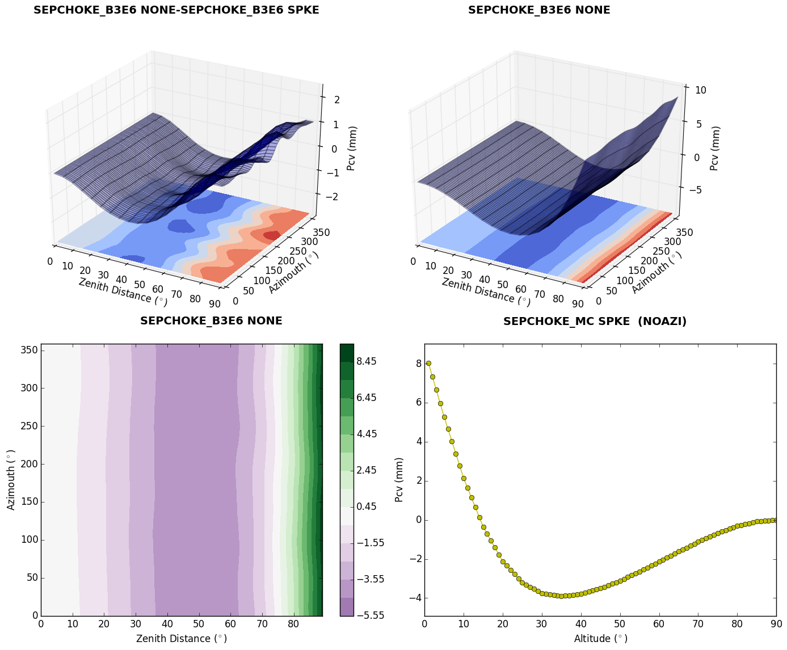

# Introduction

This repository is an effort to construct:

* a (kind-of) elementary c++ gnss-related library, with focus on scientific applications
* a collection of basic programs for analyzing gnss (and gnss related) data; these are mostly based on the (above mentioned) library.

The development will be very-very slow ...

# Installation

## Prerequisites

> :heavy_exclamation_mark: Don't even try installing the project with a compiler not supporting at least c++11.

To install the library, you will need:

* a C++ compiler supporting at least C++11 (see [C++ compiler support](http://en.cppreference.com/w/cpp/compiler_support))
* most packages of the [GNU Build System](https://en.wikipedia.org/wiki/GNU_build_system),
including:
    * [autoreconf](http://linuxcommand.org/man_pages/autoreconf1.html); normally you need to install the package `dh-autoreconf`
    * [libtool](http://www.gnu.org/software/libtool/)
    * [automake](https://www.gnu.org/software/automake/)
    * [autoconf](http://www.gnu.org/software/autoconf/autoconf.html)

Most Linux distros provide grouped-packages for easy installation; e.g. for Debian see [build-essentials](https://packages.debian.org/wheezy/build-essential) and [Getting started with Autotools – GNU Build System on Debian](http://abhinavsingh.com/getting-started-with-autotools-gnu-build-system-on-debian/); for Fedora see the package "C Development Tools and Libraries"

To install the binaries, you will need (on top of the above list):

* Python 2.7
* [python-matplotlib](http://matplotlib.org/)

To create documentation (e.g. a reference API), see [Documentation](#documentation). Hopefuly, somewhere in the near future, we are going to provide a webpage with all documents in various formats.

*We are trying to keep the installation process compatible with the [GNU Build System](https://en.wikipedia.org/wiki/GNU_build_system) but this may not always be the case.*

## Build/Install Steps

The installation process, will :
* build the library
* build the test programs
* build the executables
* install the library
* install the executables

Should you want to skip some of the above, see [FAQ](#faq2)

Clone the repository in a local folder:
```shell
   $> git clone https://github.com/xanthospap/ngpt.git
```

(this will clone the repository into a local folder named `ngpt` at the current path).

Henceforth the `ngpt` folder will be the **root_dir**.

Go to the `root_dir`. The files you will have to customize (if needed) are  [src/Makefile.am](src/Makefile.am), [test/Makefile.am](test/Makefile.am) and [bin/Makefile.am](bin/Makefile.am).
But first, you have to run the `autoreconf` tool (see [[1]](#autoreconf)):
```shell
   $> autoreconf -i
```

If you do not need the development version (with a **lot** of debugging info and no optimizations) then replace the `Makefile.am`s files with their `Makefile.am.production` counterparts (see [src/Makefile.am.production](src/Makefile.am.production) and [test/Makefile.am.production](test/Makefile.am.production)). That is:
```shell
   $> for dir in src test bin ; do cat ${dir}/Makefile.am.production > ${dir}/Makefile.am ; done
```

If your compiler/compiler version does not support **c++14**, then change that in the `Makefile.am`s to c++11, e.g.:
```shell
   $> for dir in src test bin ; do
    >    sed -i 's/-std=c++14/-std=c++11/g' ${dir}/Makefile.am
    >  done
```

Go ahead and create the `Makefile`s; these are constructed based on the `Makefile.am` you have set-up, using the configure script :
```shell
   $> ./configure
```

Now you should be good to go! Just type:
```shell
    $> make
```
to build the project.

As a final step, install the library and binaries, via the command:
```shell
   sudo make install
```
>:heavy_exclamation_mark: This step needs to be executed with super-user privileges.

You don't need to run `autoreconf` ever again! You need to run the `configure` script though, if the `Makefile[.am]`'s change.

## Documentation

To compile the documentation (including the API reference), you need to have

1. [Doxygen](http://www.stack.nl/~dimitri/doxygen/)
2. [bibtex](http://www.bibtex.org/)

If available [graphviz](www.graphviz.org/) will be used to generate the documentation graphs.

Go to the `/doc` folder and type:
```shell
   $> doxygen doxy.conf
```

This will create the doc pages under `doc/html`; start at `index.html`.

# Extracting and Plotting ANTEX information

Two of the programs installed, namely `atxtr` and `antex-view.py` are used to create 3D plots of GNSS antenna Phase Center Variation corrections. Both programs come with help messages (use `-h` or `--help`) .

The following figure is a result of `antex-view.py` program.



```shell
   ## example usage (normal surface plot for one antenna)
   $> atxtr -a igs08_1869.atx -m "SEPCHOKE_B3E6   NONE" | antex-view.py

   ## example usage (normal surface plot for one antenna for NOAZI pcv's)
   ## save plot in png format
   $> atxtr -a igs08_1869.atx -m "SEPCHOKE_MC     SPKE" -dazi 0.0 \
       | antex-view.py -i -s png

   ##  example usage (contour plot of pcv differences;
   ##+ convert zenith to altitude)
   $> atxtr -a igs08_1869.atx \
       -m "TPSCR.G3        NONE,TPSCR.G3        SCIS,TPSCR.G3        TPSH" \
       -diff \
       | antex-view.py -t contr -i
```

> **Note** ANTEX files are published by [IGS](#igs) [here](https://igscb.jpl.nasa.gov/igscb/station/general/).

## Tested Compilers & OSs

| Compiler    |  Version  |
|-------------|-----------|
| gcc-g++     | 5.3       |

# What we haven't done but **should** do

- [x] provide a *prerequisities* list
- [ ] try compiling with [libc++](http://libcxx.llvm.org/index.html)
- [ ] write a decent documentation (not just doxygen comments ...); a docbook would be nice!
- [ ] make man pages for the executables
 
# FAQ

<a name="faq1">
### + Error loading the (shared) library
</a>

> typically something like: `atxtr: error while loading shared libraries: libngpt.so.0: cannot open shared object file: No such file or directory`

The linker can't find the shared library. One way to fix this, is to run the following (as **root**):

* first make sure the library is placed in the right path (i.e. `/usr/local/lib`); listing the directory, you should see something like: `libngpt.a  libngpt.la  libngpt.so  libngpt.so.0  libngpt.so.0.0.0`. If not, then the installation has failed.
* add the path to the `/etc/ld.so.conf` file, i.e. append the line: `include /usr/local/lib` in the file.
* update the search path by running `ldconfig` as **root**.

<a name="faq2">
### + Can i only install the library (no tests, no executables) ?
<a>

To only install the library you 'll need to modify the `Makefile.am` in the `root_dir`. The contents of the `Makefile.am` should be something like: 
```makefile
   SUBDIRS = src test bin
```
If you remove the `bin` part, no executable is going to be build/installed; to also skip the test programs, remove the `test` part.

# References

<a name="autoreconf">[[1]](https://www.gnu.org/savannah-checkouts/gnu/autoconf/manual/autoconf-2.69/html_node/autoreconf-Invocation.html)</a>

<a name="igs">[International GNSS Service](http://www.igs.org/)
