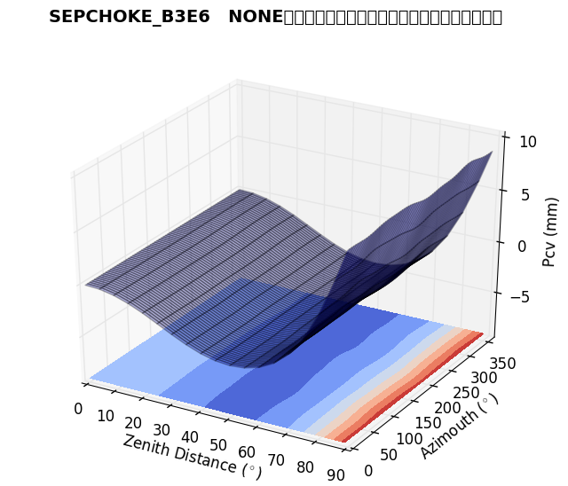

# Introduction

This repository is an effort to construct:

* a (kind-of) elementary c++ gnss-related library, with focus on scientific applications
* a collection of basic programs for analyzing gnss (and gnss related) data; these are
mostly based on the (above mentioned) library.

The development will be very-very slow ...

# Installation

## Prerequisites

> :bangbang: Don't even try installing the project with a compiler not
> supporting at least c++11.

To install the library, you will need:

* a C++ compiler supporting at least C++11 (see [C++ compiler support](http://en.cppreference.com/w/cpp/compiler_support))
* most packages of the [GNU Build System](https://en.wikipedia.org/wiki/GNU_build_system),
including:
    * [autoreconf](http://linuxcommand.org/man_pages/autoreconf1.html); normally you need
    to install the package `dh-autoreconf`
    * [libtool](http://www.gnu.org/software/libtool/)
    * [automake](https://www.gnu.org/software/automake/)
    * [autoconf](http://www.gnu.org/software/autoconf/autoconf.html)

Most Linux distros provide grouped-packages for easy installation; e.g. for Debian 
see [build-essentials](https://packages.debian.org/wheezy/build-essential)
and [Getting started with Autotools – GNU Build System on Debian](http://abhinavsingh.com/getting-started-with-autotools-gnu-build-system-on-debian/), 
for Fedora see the package "C Development Tools and Libraries"

To install the binaries, you will need (on top of the above list):

* Python 2.7
* [python-matplotlib](http://matplotlib.org/)

We are trying to keep the installation process compatible with
the [GNU Build System](https://en.wikipedia.org/wiki/GNU_build_system)
but this may not always be the case.

## Build/Install Steps

Clone the repository in a local folder:
```shell
$> git clone https://github.com/xanthospap/ngpt.git
```

(this will clone the repository into a local folder named `ngpt` at
the current path).

Henceforth the `ngpt` folder will be the **root_dir**.

Go to the `root_dir`. The files you will have to customize (if needed) are 
[src/Makefile.am](src/Makefile.am), [test/Makefile.am](test/Makefile.am) and
[bin/Makefile.am](bin/Makefile.am).
But first, you have to run the `autoreconf` tool (see [[1]](#autoreconf)):
```shell
$> autoreconf -i
```

If you do not need the development version (with a **lot** of
debugging info and no optimizations) then replace the `Makefile.am`s
files with their `Makefile.am.production` counterparts (see 
[src/Makefile.am.production](src/Makefile.am.production) and [test/Makefile.am.production](test/Makefile.am.production)). That is:
```shell
$> cat src/Makefile.am.production > src/Makefile.am   &&
   cat test/Makefile.am.production > test/Makefile.am &&
   cat bin/Makefile.am.production > bin/Makefile.am &&
```

If your compiler/compiler version does not support **c++14**, then
change that in the `Makefile.am`s to c++11, e.g.:
```shell
$> sed -i 's/-std=c++14/-std=c++11/g' src/Makefile.am
$> sed -i 's/-std=c++14/-std=c++11/g' test/Makefile.am
$> sed -i 's/-std=c++14/-std=c++11/g' bin/Makefile.am
```

Go ahead and create the `Makefile`s; these are constructed based on the
`Makefile.am` you have set-up, using the configure script :
```shell
$> ./configure
```

Now you should be good to go! Just type:
````shell
$> make
```
to build the project.

As a final step, install the library and binaries, via the command:
```shell
$> sudo make install
```
>:heavy_exclamation_mark: This step needs to be executed with super-user privileges.

You don't need to run `autoreconf` ever again! You need to run the
`configure` script though, if the `Makefile[.am]`'s change.

## Documentation

To compile the documentation (including the API reference), you need to have

1. [Doxygen](http://www.stack.nl/~dimitri/doxygen/)
2. [bibtex](http://www.bibtex.org/)

If available [graphviz](www.graphviz.org/) will be used to generate the documentation
graphs.

Go to the `/doc` folder and type:
```shell
$> doxygen doxy.conf
```

This will create the doc pages under `doc/html`; start at `index.html`.

# Extracting and Plotting ANTEX information

Two of the programs installed, namely `atxtr` and `antex-view.py` are used to
create 3D plots of GNSS antenna Phase Center Variation corrections. Both programs
come with help messages (use `-h` or `--help`) .

The following figure is a result of `antex-view.py` program.



## Tested Compilers & OSs

| Compiler    |  Version  |
|-------------|-----------|
| gcc-g++     | 5.3       |

# What we haven't done but **should** do

- [x] provide a *prerequisities* list
- [ ] try compiling with [libc++](http://libcxx.llvm.org/index.html)
- [ ] write a decent documentation (not just doxygen comments ...); a docbook would be nice!

# References

<a name="autoreconf">[[1]](https://www.gnu.org/savannah-checkouts/gnu/autoconf/manual/autoconf-2.69/html_node/autoreconf-Invocation.html)</a>
